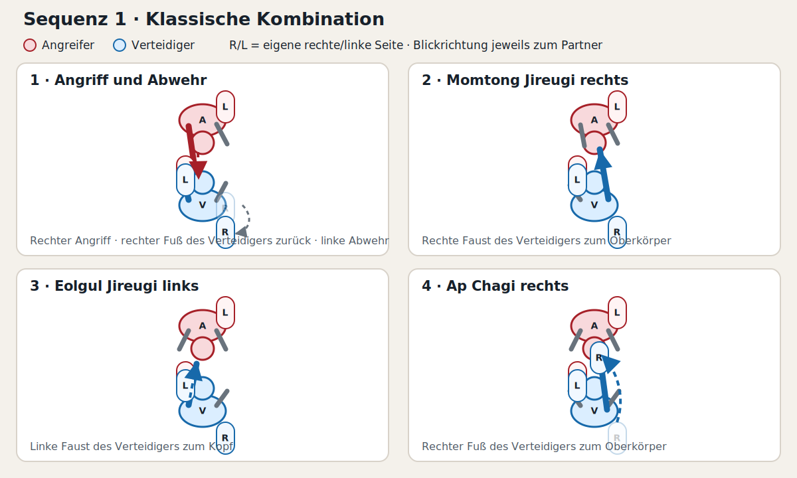
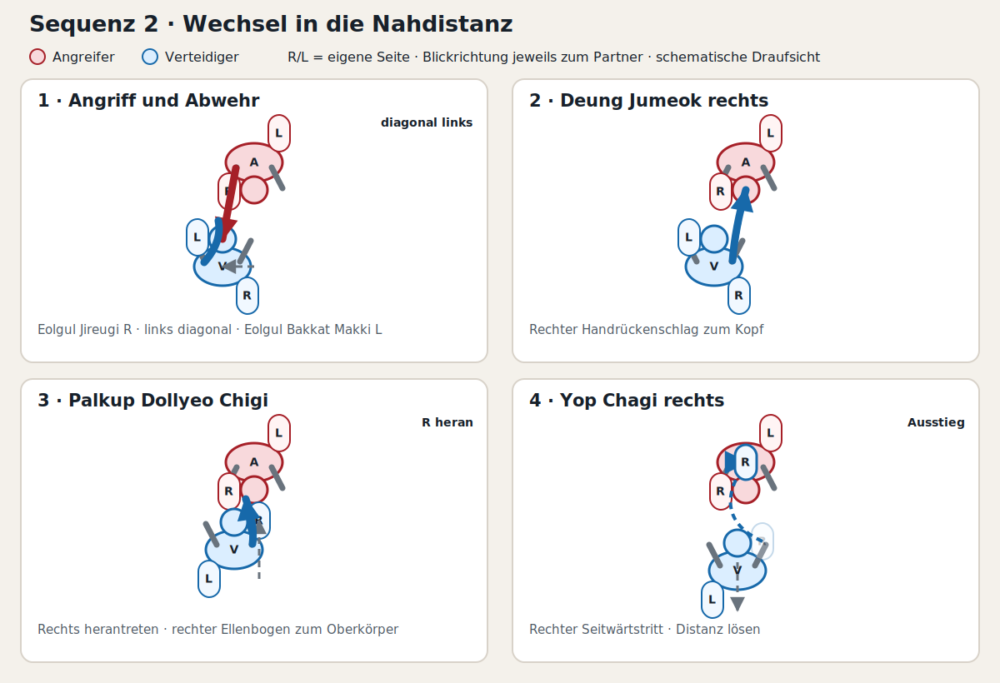
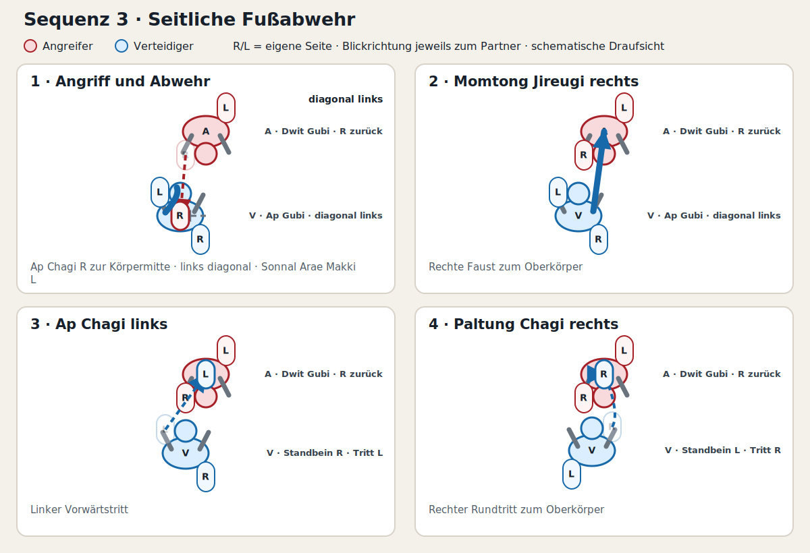
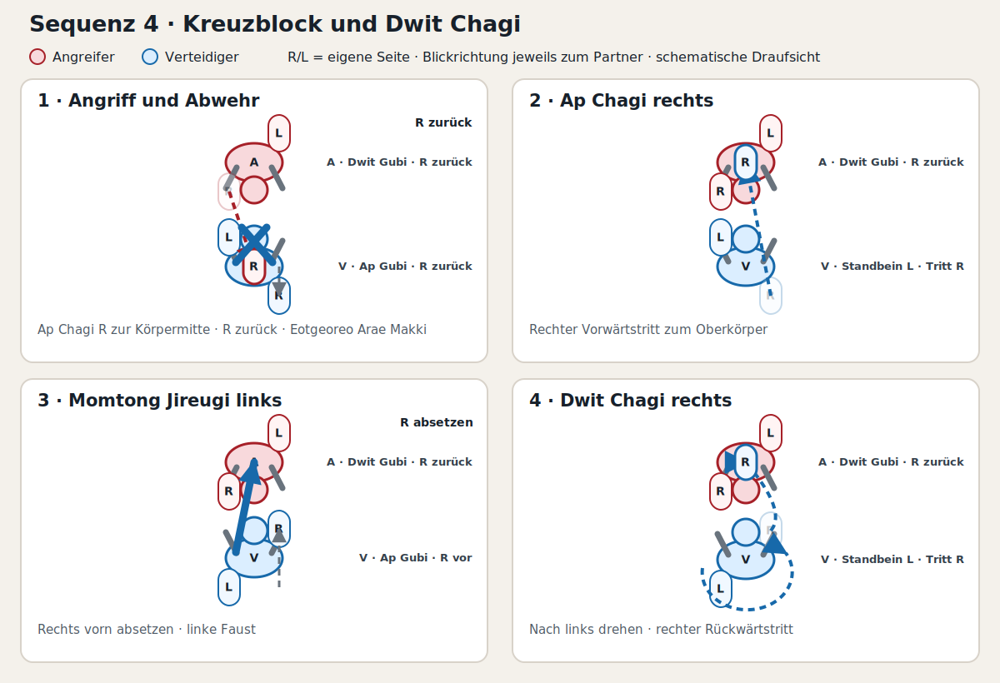
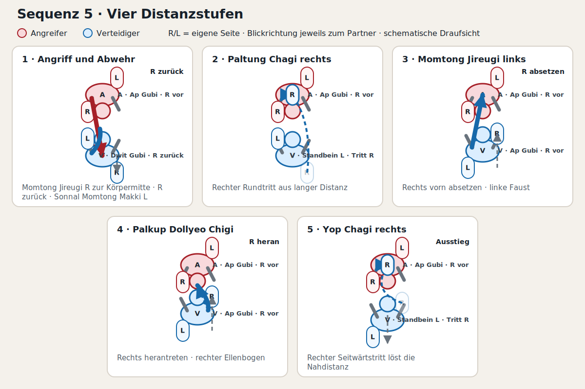
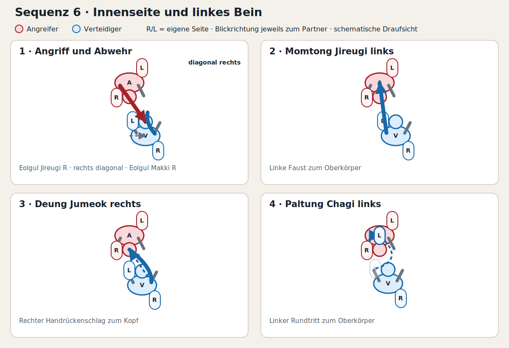
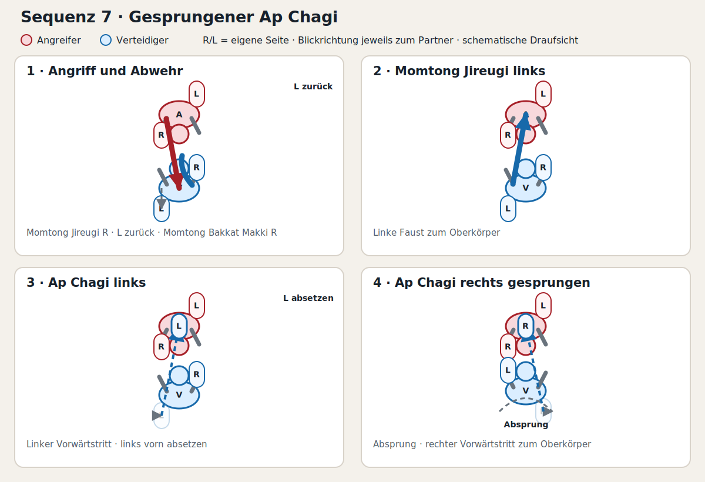
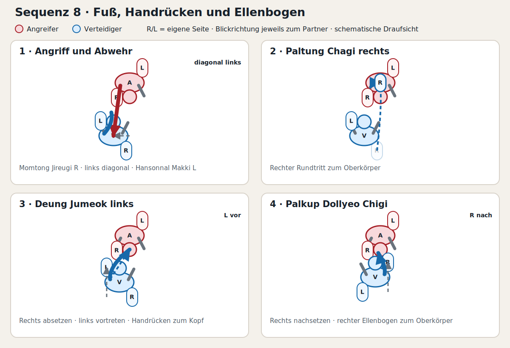

# DTU-Prüfungsprogramm: 1-Schritt-Kampf

Testprogramm mit acht verschiedenen Übungen für die Prüfung zum **1. Kup – roter Gürtel mit schwarzem Streifen**.

> **Arbeitsstand:** Alle Sequenzen zuerst langsam und ohne Kontakt testen. Distanz, Standwechsel und Zielhöhen anschließend mit dem Trainer abstimmen.

## Rahmenbedingungen

- Der Angreifer greift zunächst jeweils rechts an.
- Jede Sequenz enthält eine Abwehr und drei Folgetechniken.
- Nur Sequenz 5 enthält vier Folgetechniken, weil der abschließende Yop Chagi die Nahdistanz sinnvoll auflöst.
- Rechts ist die bevorzugte Seite.
- Kopf-, Ellenbogen- und Fußtechniken werden deutlich vor dem Ziel gestoppt.

## Sequenz 1: Klassische Kombination

**Angriff:** Momtong Jireugi rechts  
**Abwehr:** Rechten Fuß zurücksetzen, Momtong An Makki links

1. Momtong Jireugi rechts
2. Eolgul Jireugi links
3. Ap Chagi rechts zum Oberkörper

**Prinzip:** Körper → Kopf → Fußtechnik

*A = Angreifer, V = Verteidiger. R und L bezeichnen jeweils die eigene rechte beziehungsweise linke Seite der dargestellten Person.*

## Sequenz 2: Wechsel in die Nahdistanz

**Angriff:** Eolgul Jireugi rechts  
**Abwehr:** Links diagonal nach außen, Eolgul Bakkat Makki links

1. Deung Jumeok Ap Chigi rechts zum Kopf
2. Rechts herantreten, Palkup Dollyeo Chigi zum Oberkörper
3. Yop Chagi rechts zum Oberkörper und Distanz lösen

**Prinzip:** Handdistanz → Ellbogendistanz → Ausstieg

## Sequenz 3: Seitliche Fußabwehr

**Angriff:** Ap Chagi rechts  
**Abwehr:** Links diagonal ausweichen, Sonnal Arae Makki links

1. Momtong Jireugi rechts
2. Ap Chagi links
3. Paltung Chagi rechts zum Oberkörper

**Prinzip:** Ableiten → Faust → vorderes Bein → hinteres Bein

## Sequenz 4: Kreuzblock und Dwit Chagi

**Angriff:** Ap Chagi rechts  
**Abwehr:** Rechten Fuß zurücksetzen, Eotgeoreo Arae Makki

1. Ap Chagi rechts
2. Rechts vorn absetzen, Momtong Jireugi links
3. Nach links drehen, Dwit Chagi rechts zum Oberkörper

**Prüfpunkt:** Vor dem Dwit Chagi über die Schulter zum Ziel schauen. Nach dem Fauststoß muss genug Abstand für den Rückwärtstritt vorhanden sein.

## Sequenz 5: Vier Distanzstufen

**Angriff:** Momtong Jireugi rechts  
**Abwehr:** Rechten Fuß zurück in Dwit-gubi, Sonnal Momtong Makki links

1. Paltung Chagi rechts
2. Rechts vorn absetzen, Momtong Jireugi links
3. Rechts herantreten, Palkup Dollyeo Chigi zum Oberkörper
4. Yop Chagi rechts zum Lösen aus der Nahdistanz

**Prinzip:** Lange Distanz → mittlere Distanz → Nahdistanz → kontrollierter Ausstieg

## Sequenz 6: Innenseite und linkes Bein

**Angriff:** Eolgul Jireugi rechts  
**Abwehr:** Rechts diagonal aus der Trefferlinie, Eolgul Makki rechts

1. Momtong Jireugi links
2. Deung Jumeok Ap Chigi rechts
3. Paltung Chagi links zum Oberkörper

**Prüfpunkt:** Beim Test besonders auf Winkel und Gleichgewicht achten. Falls der Abschluss links nicht stabil funktioniert, wird die Sequenz auf die rechte Seite umgebaut.

## Sequenz 7: Gesprungener Ap Chagi

**Angriff:** Momtong Jireugi rechts  
**Abwehr:** Linken Fuß zurücksetzen, Momtong Bakkat Makki rechts

1. Momtong Jireugi links
2. Ap Chagi links und vorn absetzen
3. Gesprungener Ap Chagi rechts zum Oberkörper

**Prinzip:** Der erste Tritt schafft die Distanz für den gesprungenen Ap Chagi.

## Sequenz 8: Fuß, Handrücken und Ellenbogen

**Angriff:** Momtong Jireugi rechts  
**Abwehr:** Links diagonal nach außen, Hansonnal Momtong Bakkat Makki links

1. Paltung Chagi rechts zum Oberkörper
2. Rechts absetzen und mit links vortreten, Deung Jumeok Ap Chigi links
3. Rechts nachsetzen, Palkup Dollyeo Chigi zum Oberkörper

**Prinzip:** Fußdistanz → Handdistanz → Ellbogendistanz

## Checkliste fürs Probetraining

- Passt die Distanz bei jeder Folgetechnik?
- Gibt es unnötige Zwischen- oder Korrekturschritte?
- Bleibt die Endposition stabil und zum Partner ausgerichtet?
- Können Kopf- und Ellbogentechniken sicher gestoppt werden?
- Funktioniert die Technik auch bei einem Partner mit anderer Körpergröße?
- Besonders die Sequenzen 2, 4, 6 und 8 kritisch prüfen.

## Grundlage

[DTU-Prüfungsordnung 2026](https://www.dtu.de/fileadmin/Downloads/Ordnungen/2026/10.1_PO_vorl_Stand_12.02.2026.pdf): Für den 1-Schritt-Kampf im Wahlpflichtbereich sind mindestens acht verschiedene Übungen gefordert. Die konkrete Ausführung ist mit Trainer und Prüfungspartner abzustimmen.
